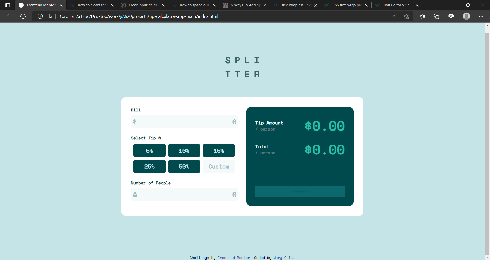

# Frontend Mentor - Tip calculator app solution

This is a solution to the [Tip calculator app challenge on Frontend Mentor](https://www.frontendmentor.io/challenges/tip-calculator-app-ugJNGbJUX). Frontend Mentor challenges help you improve your coding skills by building realistic projects.

## Table of contents

- [Overview](#overview)
  - [The challenge](#the-challenge)
  - [Screenshot](#screenshot)
  - [Links](#links)
- [My process](#my-process)
  - [Built with](#built-with)
  - [What I learned](#what-i-learned)
  - [Continued development](#continued-development)
- [Author](#author)

## Overview

### The challenge

Users should be able to:

- View the optimal layout for the app depending on their device's screen size
- See hover states for all interactive elements on the page
- Calculate the correct tip and total cost of the bill per person

### Screenshot



### Links

- Solution URL: [Solution URL ](https://github.com/adebimpecole/tip-calculator-app-main.git)
- Live Site URL: [Live site URL](https://resilient-hummingbird-f7440b.netlify.app/)

## My process

### Built with

- Semantic HTML5 markup
- CSS custom properties
- Flexbox
- Mobile-first workflow


### What I learned

How to properly use the Foreach function


```js
tps.forEach((element, index) => {
  element.addEventListener("click", () => {
      pcnt = parseInt(percent1[index].textContent);
      element.style.backgroundColor = "hsl(172, 67%, 45%)";
      element.style.color = "hsl(183, 100%, 15%)";
  })
})

document.addEventListener('keydown', (event) => {
    var name = event.key;
    var code = event.code;
})
```

### Continued development

Use of foreach control flow statement

## Author

- Website - [Cole Mary](https://resilient-hummingbird-f7440b.netlify.app/)
- Frontend Mentor - [@adebimpecole](https://www.frontendmentor.io/profile/adebimpecole)
- Twitter - [@adecole02](https://twitter.com/adecole02)

